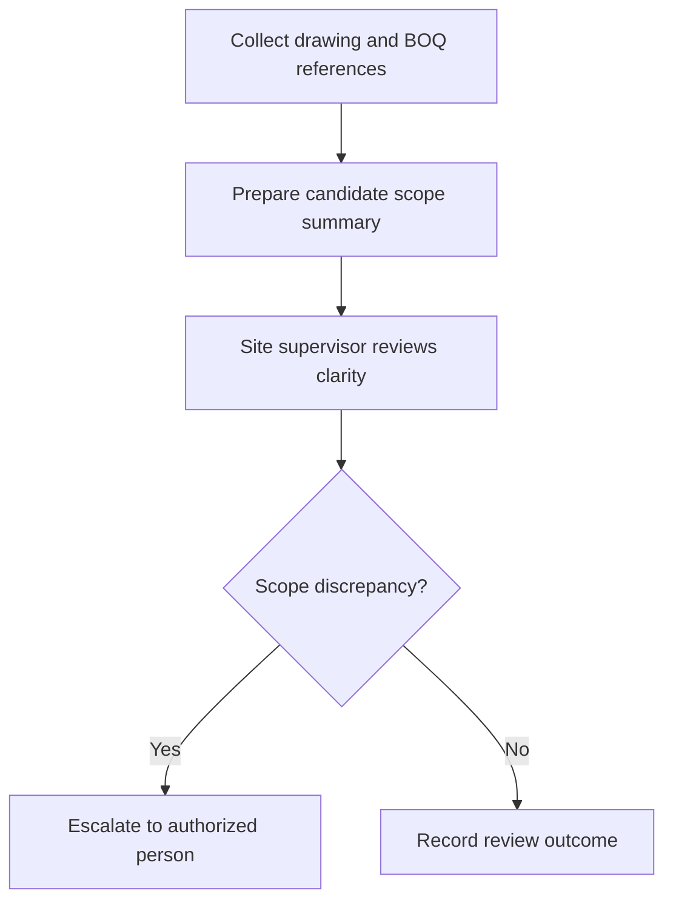

# Candidate workflow

```mermaid
flowchart TD
    A[Collect drawing and BOQ references] --> B[Prepare candidate scope summary]
    B --> C[Site supervisor reviews clarity]
    C --> D{Scope discrepancy?}
    D -->|Yes| E[Escalate to authorized person]
    D -->|No| F[Record review outcome]
```

This is a software clarification workflow, not an authorized construction sequence.
