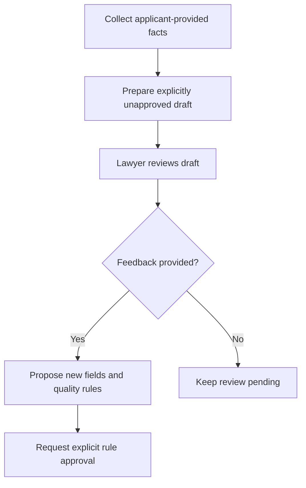

# Candidate workflow

```mermaid
flowchart TD
    A[Collect applicant-provided facts] --> B[Prepare explicitly unapproved draft]
    B --> C[Lawyer reviews draft]
    C --> D{Feedback provided?}
    D -->|Yes| E[Propose new fields and quality rules]
    D -->|No| F[Keep review pending]
    E --> G[Request explicit rule approval]
```

Unresolved: required intake fields, form revision, output file format, legal exception handling, submission boundaries, and exact reviewer authority.
